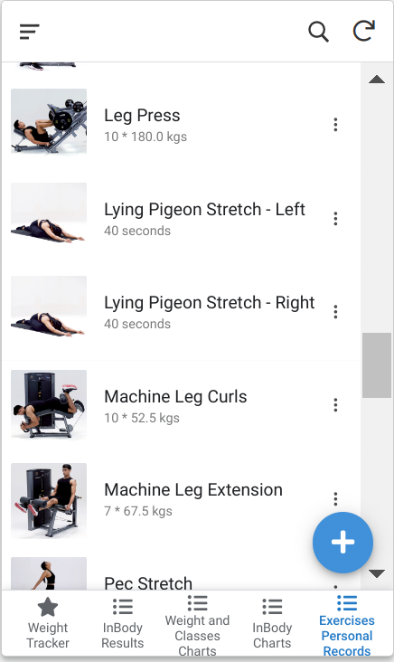

+++
title = 'Fitness Track Part 2'
date = 2023-09-30T16:31:59+05:30
draft = false
+++

## Fitness Track Part 2

This post is continuation of [Fitness Track Part 1](/posts/fitness-track/).

I finally extracted out the existing personal best for exercises as well, and added a new page in the appsheet to display them.

This one was slight tricky to implement because there did not seem to be an API which fetches all exercise details, so on trial and error, when I selected an exercise to log it in the app, it seemed to be calling an API `/api/v2/fitnessplanner/exercisesForLogging` with corresponding exerciseId under `exerciseIds` list parameter. I generated ~2-300 IDs nearby that ID and passed in the API.

Earlier I was trying with ~500 IDs but the API kept crashing, and even with 300 IDs, some of the intermediate IDs required removal (God knows why), and finally I got a JSON which looked like this:

<details> 
<summary>JSON</summary>
```json
{
    "tenantId": 1,
    "userId": "89760760",
    "exerciseId": 1555609163,
    "herculesExerciseId": "602621587d678600085608e2",
    "executionType": "TIMED",
    "meta": {
        "weightUnit": "KG",
        "durationUnit": "SECOND",
        "distanceUnit": "KILOMETRE"
    },
    "personalBest": {
        "id": 791910,
        "createdOn": "2023-02-12T08:38:49.000+00:00",
        "lastModifiedOn": "2023-02-12T08:38:49.000+00:00",
        "createdBy": "system",
        "version": 0,
        "tenantId": 1,
        "userId": "89760760",
        "herculesExerciseId": "602621587d678600085608e2",
        "userFitnessLevel": "INTERMEDIATE",
        "duration": 5400,
        "distance": 11.24,
        "fromTime": "2023-02-12T08:38:49Z"
    },
    "previousBest": {
        "duration": 1860,
        "distance": 4.04
    },
    "thumbnailUrl": "hercules/production/assets/movements/images/CROSS_TRAINER_v1631535828209_aa25d179-c9fa-4570-acc7-3d7a489b7ee9.jpg",
    "exerciseName": "Cross Trainer",
    "exerciseType": "DISTANCE",
    "lateral": "BILATERAL",
    "templateLog": {
        "sequence": null,
        "unilateralDirection": null,
        "weight": null,
        "duration": null,
        "count": null,
        "distance": null,
        "value1": "4.04",
        "unit1": "kms",
        "separator": "x",
        "value2": "31",
        "unit2": "mins"
    },
    "fpExecutionLogs": [
        {
            "sequence": null,
            "unilateralDirection": null,
            "weight": null,
            "duration": 1860,
            "count": null,
            "distance": 4.04,
            "value1": "4.04",
            "unit1": "kms",
            "separator": "/",
            "value2": "31",
            "unit2": "mins"
        }
    ]
}
```
</details>

Most of the parameters are self explanatory, rest I found by analyzing some of the JSONs manually. The analysis script using which I finally created a CSV is [analysis.py](./analysis.py), and the script to extract those JSONs is [cult_data_exercises.py](./cult_data_exercises.py).

Finally, it looks in my app like this:


