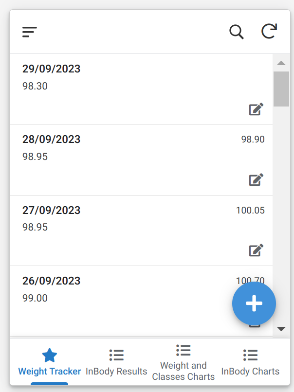
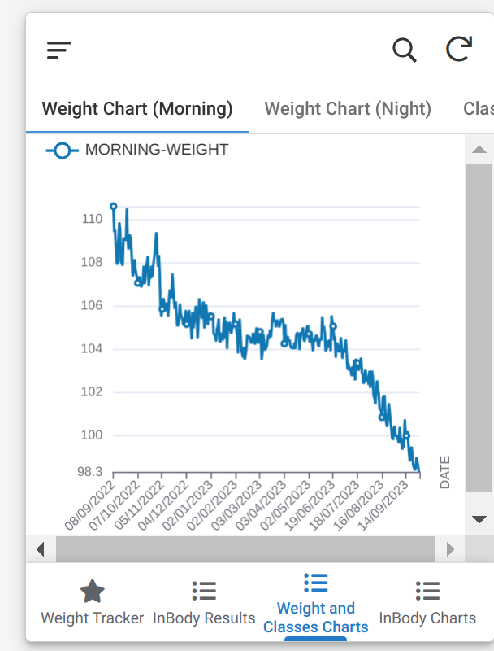

+++
title = 'Fitness Track'
date = 2023-09-29T20:48:38+05:30
draft = false
+++

# Fitness Tracking

The post will describe how I track my fitness journey so far.

Slight background: I am on the journey to be the person who goes to gym daily, my goal is to reduce weight, and get lean. I go to [cult](https://www.cult.fit/) for gym.

## What all I track so far?

- Weight (morning and night)
- Number of weeks I had been regular in gym/number of classes attended.
- Occasional BMI and other metrics from [InBody machine](https://www.inbody.in/) installed in the gym I go to.

## How I track all this?

### Weight

I have a simple google sheet which looks like this:

Column D and E are calculated as `Di = Ci - Bi`, `Ei = Bi+1 - Ci` tracking how much weight changed in that day, and the next day.

Until sometime back, this was the interface I used for updating weight everyday: open sheet, add date if not there, add the weight entries. I have a better way which uses this sheet itself as database/backend, gonna come to it at the end.

### Number of weeks I had been regular in gym/number of classes attended.

This data is something I occasionally run a script (I should probably automate this) which calls CULT's API to get the data, and I put that manually into a google sheet then.
Figuring out exact API was done by downloading raw cult apk, pass it through [apk-mitm](https://github.com/shroudedcode/apk-mitm) and then use [http-toolkit](https://httptoolkit.com/) to intercept the traffic while I visit corresponding page in the app to see the API that the app calls..

The script looks something like in [this](./cult_data_extract.py).

The sheet then looks like  with self-explanatory column names.

Again, this sheet also acts as a backend now, with frontend I will describe at the end on how do I visualize all this.

### Occasional BMI and other metrics from InBody machine installed in the gym I go to.

This is also backed by google sheet, and I have no automated way to get this data, I just manually enter it into the sheet.

From the GYM, I get the data printed on a page, from which I manually enter to the frontend I am gonna describe next.

The sheet by the way looks like:

## Frontend for all this

Entering all this data manually into the google sheet is a hard task, which lead me sometimes missing recording the data. So, I tried to follow the advice that `Atomic Habits` book's second rule of habit formation preaches: `Make it easy`.

So, the simplest way I thought was having an app in which I can quickly crunch in numbers (Ik google sheet also is the same thing, but the interface is hard to enter on the phone), so I used [appsheet](https://www.appsheet.com/) to quickly create a UI on top of the google sheets.

My app looks something like this:

### Landing screen

This shows the weight entries, and a `+` button to add in new entries, and clicking on anyone brings interface like this: , where I can edit during night to record night weight.

### InBody Results

Exactly similar to Landing screen, but another tab at the bottom for this.

### Charts - Weight and Classes

The third tab has charts for how weight is progressing and for cult gym classes.

### InBody charts

The last one has inbody charts for metrics: Body Fat Percentage, Total Fat (kg), Muscle Mass (kg), Visceral Fat Level, Waist Hip Ratio.
